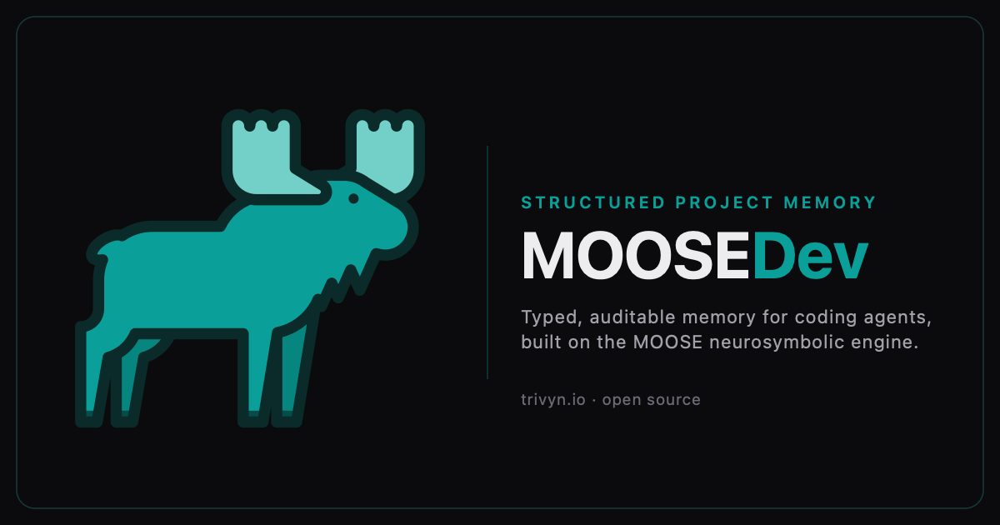

<p align="center">
  <a href="https://trivyn.io/blog/introducing-moosedev/">
    
  </a>
</p>

# MOOSEDev

**Structured, long-term project memory for coding agents, built on neurosymbolic AI**

> [!WARNING]
> MOOSEDev is under heavy development and is not production-ready. Expect breaking changes, incomplete integrations, and rough edges. It is best suited to experimentation and evaluation, not critical production workflows.

## What is MOOSEDev?

MOOSEDev is a local project-memory service that helps coding agents and humans preserve and recover the reasoning behind a software project. Agents use it through the [Model Context Protocol](https://modelcontextprotocol.io) (MCP), editors use its Knowledge-LSP, and humans can inspect and ratify knowledge in the web workbench.

Its purpose is to fight **comprehension debt**, the gradual loss of shared understanding about why a codebase is shaped the way it is. Instead of treating old chat logs or free-text notes as memory, MOOSEDev maintains a typed, queryable project knowledge graph containing architectural decisions, requirements, constraints, lessons, patterns, anti-patterns, rationales, and their relationships.

MOOSEDev is built on the **MOOSE** neurosymbolic engine. MOOSEDev itself is open source; the MOOSE engine is closed source.

## Why use it?

- **Knowledge has structure.** Decisions, constraints, lessons, and requirements are typed graph records, not undifferentiated text chunks.
- **Recall is symbolic and traceable.** Lifecycle state, typed relationships, validation, and execution traces help agents retrieve current, inspectable knowledge instead of relying only on similarity search.
- **Memory connects to code.** Records can be attached to the functions, types, files, and components they govern, then surfaced through MCP or an editor.
- **You retain control.** MOOSEDev runs locally. The project graph is stored as canonical N-Quads that can be reviewed, versioned, and shared with the codebase.

MOOSEDev runs without an LLM or API key in pure-symbolic mode. An OpenAI-compatible model can be configured for assisted natural-language features, but it is optional and does not replace the graph as the source of truth.

## How it works

```text
  Coding agents ── MCP ───────┐
  Editors ─────── Knowledge-LSP├──▶ MOOSEDev shared daemon
  Host hooks ──── policy events┘       │
                                       ├── code index
  Human workbench ◀── HTTP ────────────┤
                                       ├── project knowledge graph
                                       └── MOOSE reasoning engine
```

The recommended setup uses one shared daemon to own the project graph. MCP clients, editor integrations, host hooks, and the web workbench all use the same knowledge and policy engine, so they do not become competing sources of truth.

## Quick start

### 1. Install MOOSEDev

Use the install script on macOS Apple Silicon or Linux x86-64:

```sh
curl -fsSL https://raw.githubusercontent.com/Trivyn/moosedev/main/scripts/install.sh | sh
```

Or install with Homebrew:

```sh
brew install Trivyn/moosedev/moosedev
```

Published releases are self-contained and include the runtime resources and local embedding weights. See the [installation guide](docs/install.md) for platform notes, upgrades, verification, and source-build requirements.

### 2. Initialize a project

From the project you want MOOSEDev to remember:

```sh
cd /path/to/your/project
moosedev init
```

`init` safely merges a MOOSEDev MCP entry into the project, adds the version-control rules for project memory, and installs the agent workflow files. It does not overwrite an existing `CLAUDE.md` or remove other MCP servers.

Add only the integrations you use:

```sh
moosedev init --codex          # Codex config and skills
moosedev init --claude-hooks   # Claude Code policy hooks
moosedev init --opencode       # opencode adapter
moosedev init --zed            # Zed Knowledge-LSP settings
moosedev init --vscode         # VS Code Knowledge-LSP settings
```

Flags can be combined, and repeated runs merge safely. Reload your MCP client after initialization.

### 3. Seed the project memory

A new graph is empty. Ask your coding agent:

> Bootstrap this repository's memory into MOOSEDev.

The bootstrap workflow surveys the codebase and records its current architecture, decisions, constraints, and lessons as typed, linked knowledge. MOOSEDev also supports [temporal bootstrap](docs/reference.md#temporal-bootstrap) from git history for projects that need a historical decision timeline.

### 4. Use and commit the memory

Once the graph is seeded, agents can recall relevant context before work, query relationships, capture new decisions, and retrieve the dossier for a specific code entity. For example, ask:

> What constraints and prior decisions govern this module?

The canonical project graph lives at `.moosedev/kg.nq`. Commit it with the project configuration so teammates and future agents inherit the same knowledge:

```sh
git add .moosedev/kg.nq .mcp.json .gitignore
git commit -m "Add MOOSEDev project memory"
```

Review and include any additional agent or editor files generated by the integration flags you selected.

For the full onboarding flow, see the [Quickstart](docs/quickstart.md).

## Optional code and editor integration

MOOSEDev can index Rust, TypeScript, and Python projects so knowledge can be linked to stable code entities and surfaced in the editor:

```sh
moosedev index
moosedev mint
moosedev mint --apply
```

`mint` previews its graph changes unless `--apply` is present. The Knowledge-LSP can then provide entity-dossier hovers, knowledge diagnostics, code lenses, and proposal-based code actions.

Editor setup is available for [Zed](clients/zed/README.md), [Neovim](clients/nvim/README.md), [VS Code](clients/vscode/README.md), and [Emacs](clients/emacs/README.md). See the [Quickstart](docs/quickstart.md#6-enable-the-code-layer--editors) for the complete code-layer flow.

## Human workbench

The shared backend includes a loopback-only web workbench for browsing the graph and reviewing proposed records and links. Open it with:

```sh
moosedev ui
```

Classifier judgments and editor-originated proposals do not become authoritative until a human ratifies them in the workbench. The workbench also includes Stories, which turn accepted graph evidence into guided, inspectable explanations of project subjects.

## Version-controlled memory

`.moosedev/kg.nq` is the committed source of truth for a project's memory. It is canonical, sorted N-Quads, so additions and lifecycle changes can be reviewed in ordinary pull requests. The RocksDB store, vector databases, sockets, and other runtime files under `.moosedev/` are derived local state and should remain ignored.

MOOSEDev keeps the text graph synchronized after writes and uses it to hydrate a fresh local store after cloning. See the [reference guide](docs/reference.md#project-memory-and-graph-files) for reconciliation, backup, import, and export behavior.

## Documentation

- [Quickstart](docs/quickstart.md): installation, initialization, bootstrap, and first use
- [Installation](docs/install.md): supported platforms, verification, upgrades, and source builds
- [Reference](docs/reference.md): tools, commands, shared mode, graph operations, and configuration
- [Design of record](spec/MOOSEDev_design.md): architecture and implementation rationale
- [Project instructions](AGENTS.md): design invariants and development practices

## Open source and the MOOSE boundary

MOOSEDev, including this MCP server, its tools, ontologies, prompts, and documentation, is open source under the Apache License 2.0.

The underlying MOOSE engine remains closed source for now. Published MOOSEDev binaries are the supported route for users without access to the private engine. Building from source requires a sibling checkout of MOOSE and its patched dependencies.

Contributions to the open parts of MOOSEDev are welcome. Engine changes are outside the scope of this repository, but capabilities MOOSEDev needs from MOOSE are documented in [`spec/core-moose-asks.md`](spec/core-moose-asks.md).

## License

MOOSEDev is licensed under the [Apache License 2.0](LICENSE). The MOOSE engine is proprietary and separately licensed.
